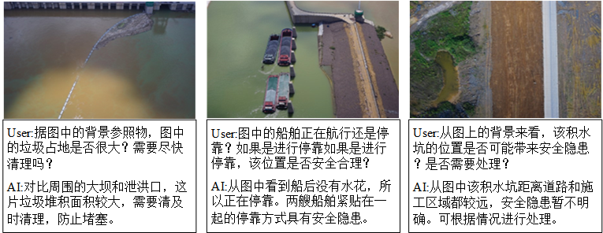
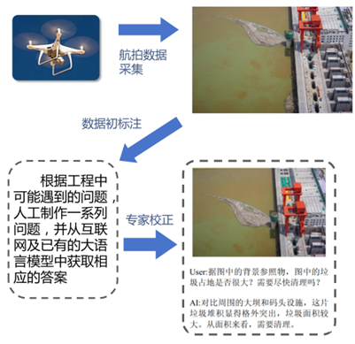
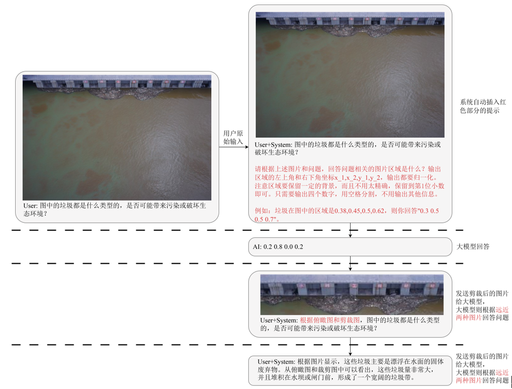
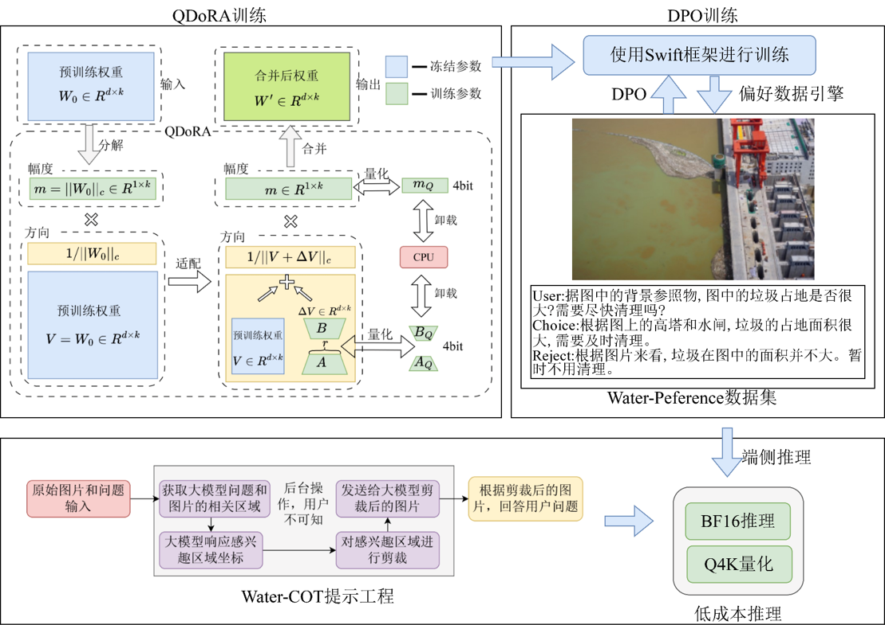

# 水利多模态问答数据集WaterVQA

## 1. 数据集简介
通过收集大量与水利环境生态管理相关的文本数据，包括政策文件、专家报告、历史案例等。并将流域生态变化检测和水资源污染要素检测等智能感知结果转化为结构化的“文本+图像”描述，加入到WaterVQA数据集中，推动水利工程领域的自然语言处理研究。

该数据集包含了约1000个标注的问答对，其特点在于图片内容和对应的问答形式均展现出高度多样性。我们设计了多种不同的提问方式，以捕捉图像信息的不同维度和细粒度特征，这种多角度的问答设计丰富了数据集的语义信息和挑战性。

WaterVQA数据集的构建流程在借鉴通用领域数据集标注经验的基础上，创新性地融合了通用大模型辅助与人类专家精修相结合的策略。传统的完全依赖人类专家标注方式，尽管能保证数据质量，但在面对大规模数据需求时，其高昂的时间和人力成本几乎是难以承受的。而完全依赖大模型进行自动化标注，虽然效率高，却往往伴随着知识性错误、事实性偏差以及对水利专业术语理解不准确等问题，产生大量低质量甚至错误数据，后期修正成本高。因此，本文提出的AI和人类专家混合标注流程，旨在充分发挥大模型在文本生成和信息整合方面的效率优势，同时利用人类专家的专业知识和判断力对生成的标注进行精准修正和质量把控。确保了WaterVQA数据集的专业性和准确性，为水利知识问答模型的训练提供了高质量语料。

## 2. 数据集特点

数据采集阶段，我们收集了大量的与水体相关的图片资源。随后进入数据预处理阶段，对采集到的原始数据进行清洗、格式统一等操作，确保后续处理的有效性。紧接着是大模型零样本图片分类阶段，利用大型预训练模型的零样本能力对图片进行初步的主题或内容分类，这有助于后续标注的效率和准确性。

针对高清图像处理中，特别是小尺寸目标特征易因压缩而损失的挑战，本文提出了Water-CoT提示方法，如下图所示。

我们采用了QLoRA微调方法，其关键技术创新主要体现在以下几个方面：首先，它采用4-bit量化技术对预训练模型的权重进行压缩。具体而言，QLoRA使用了一种称为4-bit NormalFloat(4-bit NF4)的量化方案，这种方案能够在极低的比特率下保留模型的关键信息。与传统的8-bit量化相比，4-bit量化可以将模型的内存占用进一步压缩约50%。

## 3. 数据集下载
假期团队正在做 WaterQA 数据集的升级和完善，我们会及时更新链接，请届时下载，谢谢。

## 4. 数据集使用须知

### 4.1 引用说明
如果您在研究中使用了本数据集，请点击本项目右侧的`Cite this repository`进行引用。

### 4.2 使用协议
本数据集基于知识共享署名-非商业性使用-相同方式共享 4.0 国际 (CC BY-NC-SA 4.0) 协议授权使用。

您可以自由地：
- 共享 — 在任何媒介以任何形式复制、发行本作品
- 演绎 — 修改、转换或以本作品为基础进行创作

惟须遵守下列条件：
- **署名** — 您必须给出适当的署名，提供指向本许可协议的链接，同时标明是否作了修改。
- **非商业性使用** — 您不得将本作品用于商业目的。
- **相同方式共享** — 如果您再混合、转换或者基于本作品进行创作，您必须基于与原先许可协议相同的许可协议分发您贡献的作品。

### 4.3 联系方式
如果对数据集有任何问题，欢迎联系：zhou_wei@xtu.edu.cn
